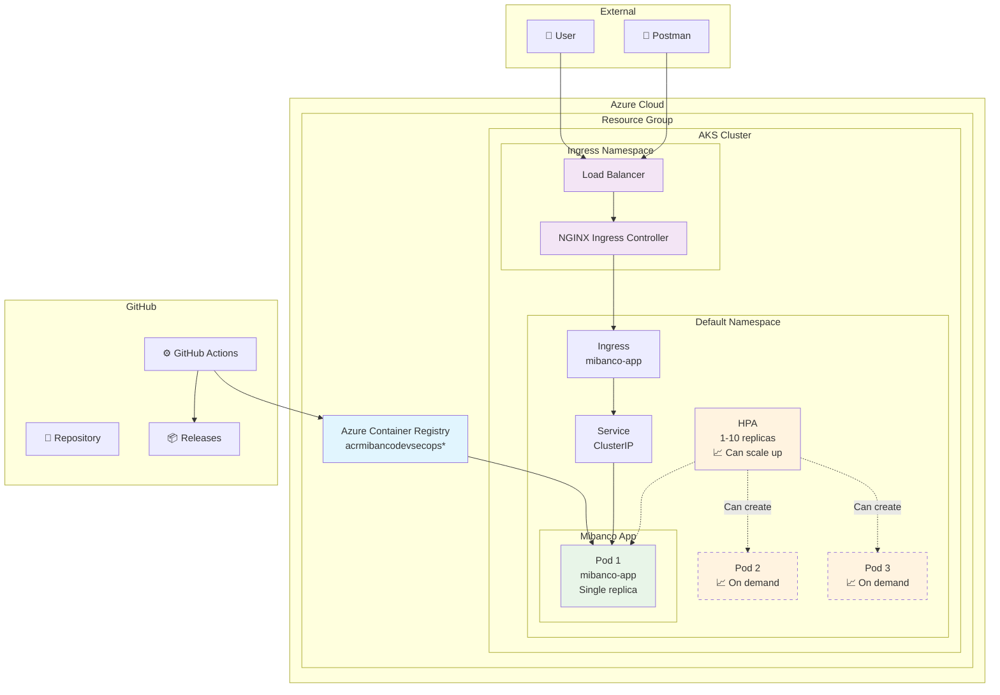
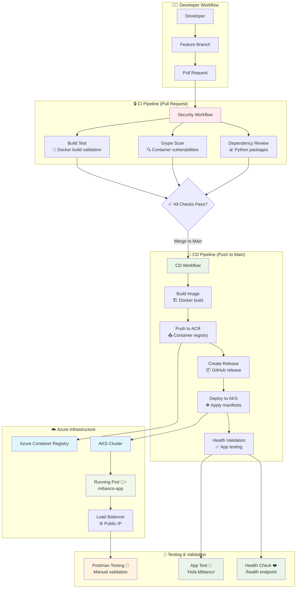
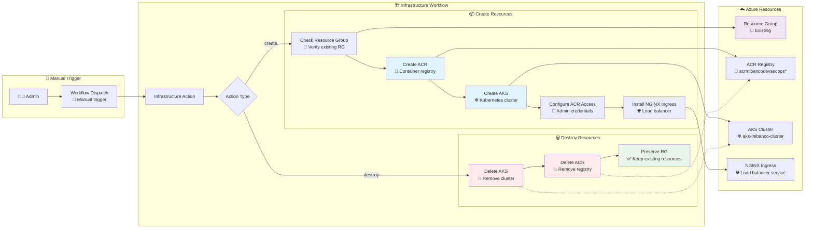

# Reto Técnico DevSecOps - Mibanco

Implementación completa de flujo DevSecOps para el reto técnico de Mibanco. Incluye aplicación Flask, pipelines CI/CD automatizados, escaneo de seguridad y despliegue en Azure Kubernetes Service.

**Funcionalidad**: API que responde `{"message": "Hola Mibanco"}` en el endpoint raíz.

## Arquitectura

- **Aplicación**: Python Flask containerizada
- **Registry**: Azure Container Registry (ACR)
- **Orchestration**: Azure Kubernetes Service (AKS)
- **Ingress**: NGINX Ingress Controller
- **CI/CD**: GitHub Actions
- **Security**: Dependency Review + Grype scanning

# Diagramas

## Arquitectura de Infraestructura



## Flujo CI/CD Completo



## Workflow de Infraestructura (Manual)



## 📁 Estructura del Proyecto

```
├── .github/workflows/
│   ├── ci.yml              # Escaneo de seguridad en PRs (check requireds)
│   ├── cd.yml              # Pipeline de deployment
│   └── infrastructure.yml  # Provisioning de infraestructura
├── src/
│   ├── app.py              # Aplicación Flask
│   ├── requirements.txt    # Dependencias Python
│   └── Dockerfile         # Imagen de contenedor
├── k8s/
│   ├── deployment.yml     # Pods de la aplicación
│   ├── service.yml        # Servicio interno
│   ├── hpa.yml            # Auto-scaling
│   └── ingress.yml        # Acceso externo
└── README.md
```

## ⚙️ Setup e Instalación

### 1. **Configurar Secretos en GitHub**

```bash
# Settings → Secrets → Actions
AZURE_CREDENTIALS = {
  "clientId": "tu-client-id",
  "clientSecret": "tu-client-secret", 
  "subscriptionId": "tu-subscription-id",
  "tenantId": "tu-tenant-id"
}
```

### 2. **Crear Infraestructura**

1. Actions → **Provision Infrastructure** 
2. Run workflow → Action: `create`
3. Copiar ACR name del output

### 3. **Configurar CD Pipeline**

Actualizar `REGISTRY_NAME` en `.github/workflows/cd.yml` con el ACR creado.

### 4. **Activar Branch Protection**

Settings → Rules → New Ruleset:
- Require pull request reviews (1)
- Restrict deletions
- Block foce pushes

## Workflows

### **CI** (Pull Requests)
- **Dependency Review**: Análisis de vulnerabilidades en dependencias
- **Grype Scan**: Escaneo de vulnerabilidades en contenedores

### **CD** (Push a main)
1. **Build**: Construye y sube imagen a ACR
2. **Release**: Crea GitHub release automático
3. **Deploy**: Despliega a AKS con todos los manifiestos
4. **Validate**: Verifica health de la aplicación

### **Infrastructure** (Manual)
- `create`: Provisiona AKS, ACR e Ingress
- `destroy`: Elimina recursos

## Testing

### **Obtener IP Externa**
```bash
kubectl get service -n ingress-nginx ingress-nginx-controller
```

### **Test de la Aplicación**
```bash
# Main endpoint
GET http://[EXTERNAL-IP]/
Response: {"message": "Hola Mibanco"}

# Health check
GET http://[EXTERNAL-IP]/health  
Response: {"status": "healthy"}
```

## Seguridad Implementada

- ✅ **Dependency scanning** en PRs
- ✅ **Container vulnerability scanning** con Grype
- ✅ **Non-root containers** con security contexts
- ✅ **Rulesets** con PR approvals
- ✅ **Resource limits** y security policies

## 📊 Manifiestos K8s

- **deployment.yml**: 1 replica con health checks y security contexts
- **service.yml**: ClusterIP para comunicación interna
- **hpa.yml**: Auto-scaling 2-10 pods basado en CPU/Memory
- **ingress.yml**: NGINX para acceso externo

## Comandos Útiles

```bash
# Conectar al cluster
az aks get-credentials --resource-group [RG] --name aks-mibanco-cluster-prd

# Ver pods
kubectl get pods -l app=mibanco-app

# Ver logs
kubectl logs -l app=mibanco-app

# Port forward para test local
kubectl port-forward service/mibanco-app-service 8080:80
```

## ✅ Requisitos Cumplidos

### **Funcionales**
- [x] Aplicación "Hola Mibanco"
- [x] Automatización con GitHub Actions  
- [x] Trunk-based development
- [x] Recursos Azure automatizados

### **Técnicos**
- [x] AKS + ACR + Ingress Controller
- [x] Build y push automatizado
- [x] Deploy con manifiestos K8s completos
- [x] Validación de pods y servicios
- [x] Rulesets con PR approvals
- [x] Escaneo de seguridad (opcional)

## 🎯 Características Destacadas

- **GitOps**: Trunk-based development con PR obligatorios
- **Security**: Scanning automatizado en pipeline
- **HA**: 3 replicas con auto-scaling
- **Monitoring**: Health checks y resource monitoring
- **Automation**: Infrastructure as Code completo